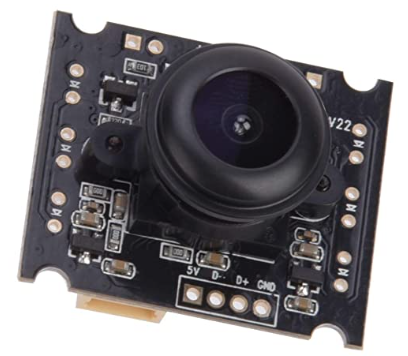

# Camera Module V2

This camera is available as an alternative to the standard recommended camera.  In some areas, it was found that the standard camera was either unavailable or too expensive. 

The V2 camera module has a different form factor that the standard module so it requires its own housing and light ring design. 

Please use the [instructions](Camera%20Assembly%20V2.pdf) included in this folder for the camera assembly. 

