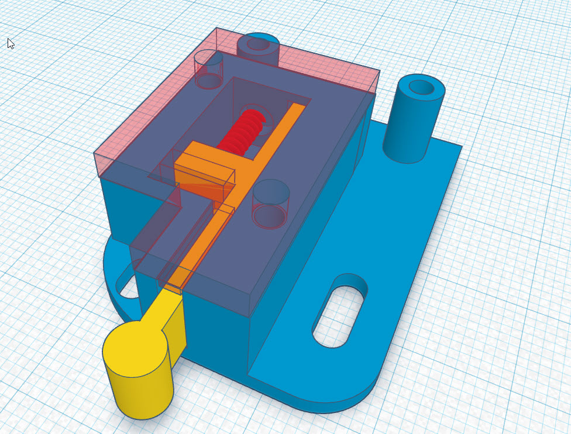
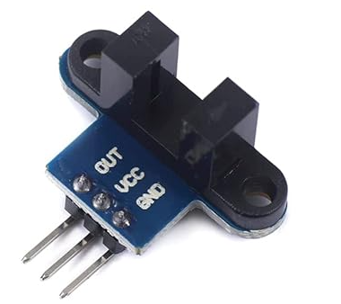
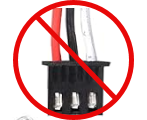
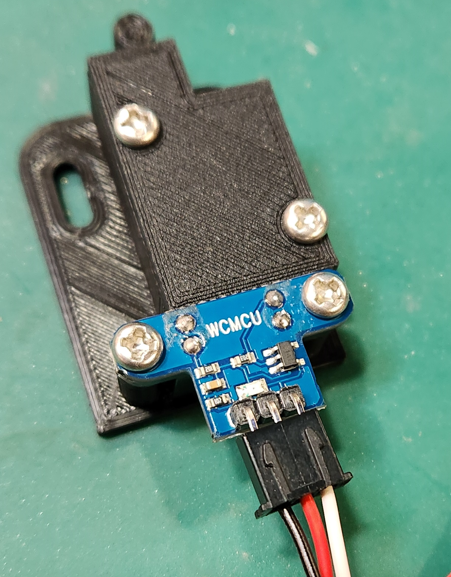
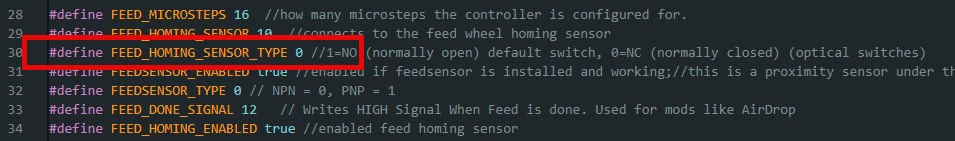

# Drop In Optical Homing Sensor

This is a drop-in replacement for the current mechanical limit switch used in the feed homing operation. 

It involves 5 basic parts:

1. Sensor Base
2. Sensor Piston
3. Sensor Lid
4. spring (.3mm x 4mm x 20mm) or (.012"x0.16"x0.79") 
5. Optical Optocoupler Module

All screw holes are M3  7-10mm length

# Wiring Updates

IMPORTANT! : Connecting the existing wire without modification may destroy the optical sensor!!!

You will need to modify the existing connector and switch the red and black wires so that they match the following example:  

Red should be in the middle and represents the 5v connection. Black is ground, white is signal.

# Shopping List

Springs: https://www.amazon.com/Cilky-Compressed-Stainless-Diameter-Compression/dp/B0CVRZCPCM/?th=1

Optical Sensor: https://www.amazon.com/gp/product/B08977QFK5

# Arduino Update Required
For this switch, there are some updates to the arduino code and you need to be running the latest version  (version: **CS 7.1.240716.1** or newer )

You will need to make a change to the parameter named **FEED_HOMING_SENSOR_TYPE** and set it to from 1 to 0 as seen in the following screenshot.

Push the code to your device and you are good to go!