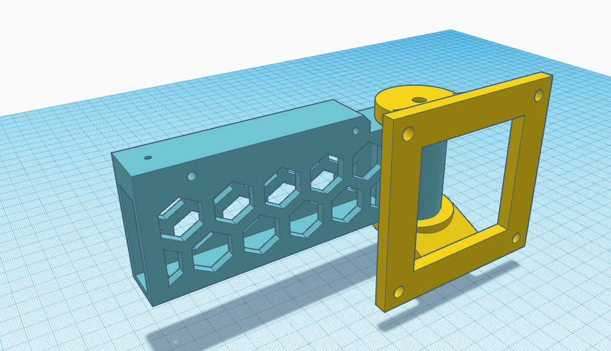
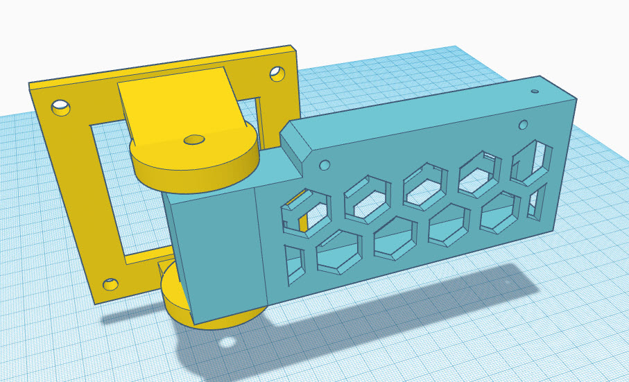

# Vesa Mount Print Instructions

The bracket should be printed with supports but set the minimum support angle to 88 Degrees so that it only prints support in the square channel. The supports are easier to remove if you align the bracket long-wise with your X axis. Just poke something through the holes to break the support connection and pull the whole support structure out the end in one piece. 

I recommend strong materials for both the bracket and the mount. PLA+ or PETG with layer height of .2 or smaller. 

The VESA mount should be printed with supports above 50 degrees. Again, strong materials should be used 


```python
 ________________
|       _        |
|      | |       |
|      | |       |
|      | |       |
|     d  |       |
|      ¯¯¯       |
|                |
¯¯¯¯¯¯¯¯¯¯¯¯¯¯¯¯¯¯
```





