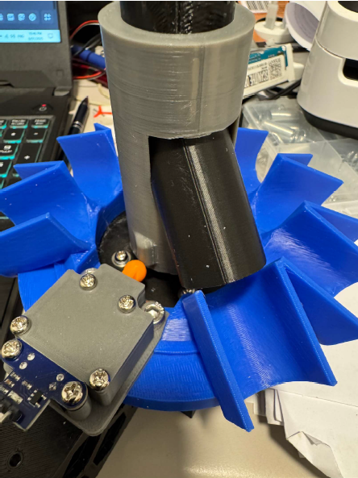
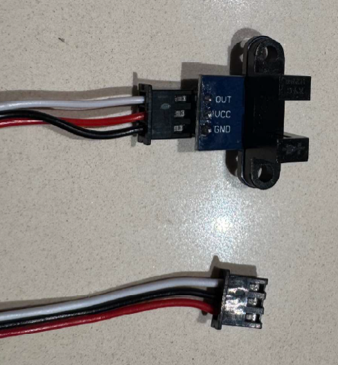
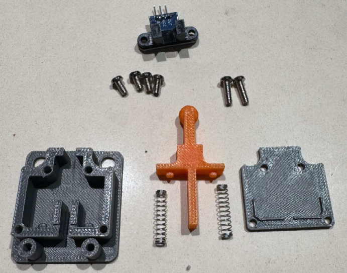
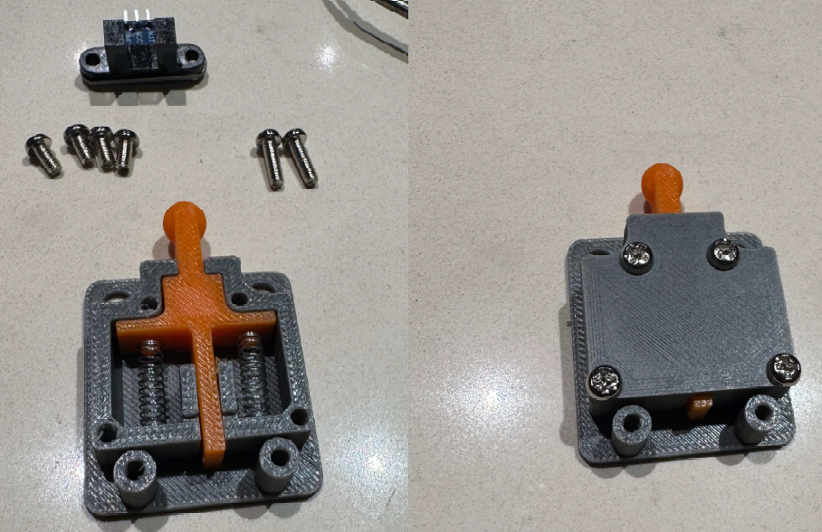
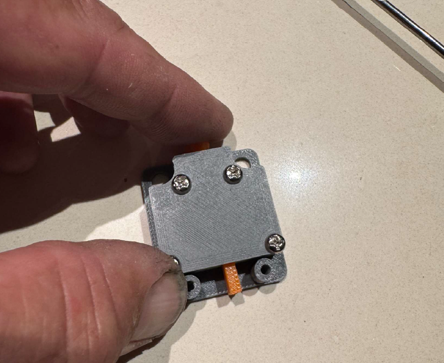
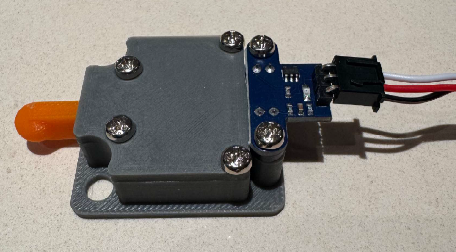

# Optical Sorter Switch Mod

### Requirements:
The Sorter optics homing sensor mod requires the following items for the mod to work. 

1. New sorter tube support with the homing point repositioned on the support to allow for new position of switch. I have designed this to have a slide on lock ring locking the sorter tube in position. 

2. The components of the optical switch, the housing, the lid and the plunger. Which will all be 3D printed with the STL file provided and attached.

3. You will also require an optical IR Sensor H206 Module type. M3 Screws and 2 X Compression Spring 0.3 X 4mm OD X15mm long.

 

### Wiring Changes Required
Correct connection of power, ground and signal is required as per the optical IR sensor WYC­H206.

### The Main component ready to assemble

### Assembly of switch 

 

### Interrupter for IR 
The next Picture shows the interrupt for IR sensor. This can be fine tuned by simply sanding the length down to allow for correct homing location.

### Fully assembled 

