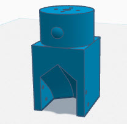
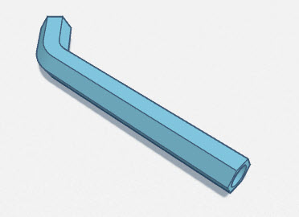

# Long Arm Hex Sort

These resources were created for those who would like to have more slots than the standard 8 provided.  By extending the arm length, we swing in a wider radius thus creating more room for buckets or containers. To make this possible, I had to change the geometry of the sort tube to have a hexagon outer contour which allows it to be printed on its side. This also has the effect of aligning the print lines with the direction the brass flows so it provides improved drop performance.

To get started, you need to print all 3 resources

[Hex Pipe Bracket](CS7.1%20-%20LAHS%20-%20Pipe%20Bracket.stl)

[Hex Pipe 200mm Length](CS7.1%20-%20LAHS%20-%20HexPipe%20-%20200mm.stl)

[Homing Bracket](CS7.1%20-%20LAHS%20-%20Homing%20Bracket.stl)

Here is a short video of what it will look like

Additionally, you will need to make some configuration updates in the AI Sorter software. 
- Set **Sort Motor Speed** to 80  (or slower)
- Set **Slot Drop Delay** to 600 (if not, the brass wont clear the tube before move)
- Set the **Slot Step Increment** to 15
- Increase the **Slot Count** to 11.

]

