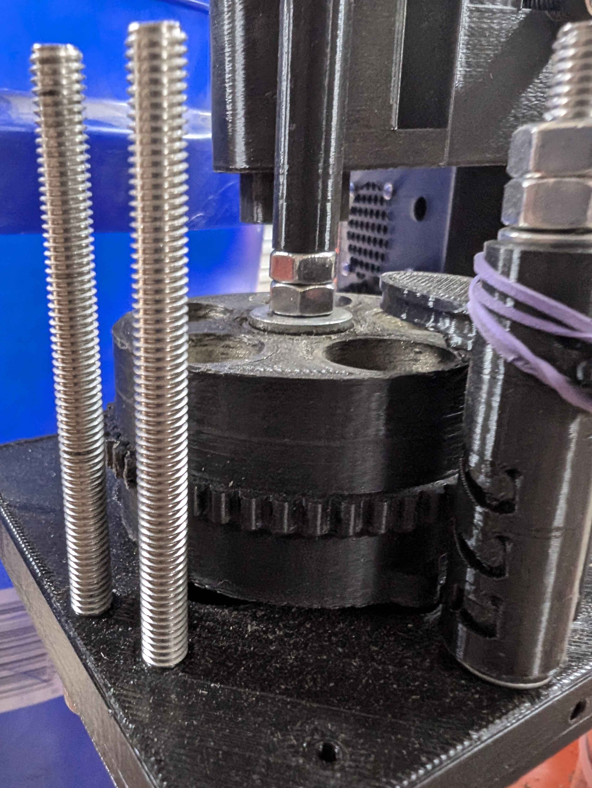

# Height Sorter Mod

This mod is was designed by user JK and made to sort brass by height which is usefull for seperating 223 from 300 BLK or 9mm from 380, etc. 

It requires seperate arduino code (in this folder) and leverages a different classifier base design as well as a taller tension cam. 

<i> More details coming soon! </i>